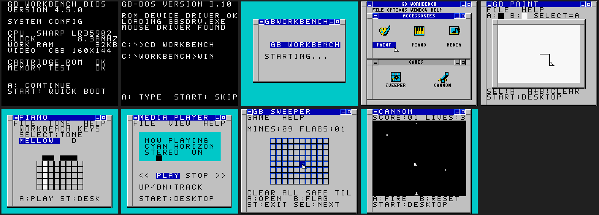

# GB Win 3.1

A clean-room Game Boy Color desktop simulation inspired by classic Windows 3.1
interaction and visual design. The ROM now provides a BIOS/DOS boot illusion,
a pointer-driven Program Manager, Paint, Piano, Media Player, Sweeper, Cannon,
sound, and deterministic visual tests.

The desktop now follows a tiled Windows 3.1 Program Manager layout with a
packed native font, independently spaced captions, active/inactive groups, and
five original 16 x 16 icons.



This is native GBC software, not a Windows emulator or a copy of the commercial
GBS Windows ROM. The audit, target definition, phased roadmap, and remaining
parity work are in [docs/REBUILD_PLAN.md](docs/REBUILD_PLAN.md); current test
evidence is in [docs/QA_REPORT.md](docs/QA_REPORT.md), with the selected desktop
comparison in [design-qa.md](design-qa.md).

## Build

Install [GBDK 4.5.0](https://github.com/gbdk-2020/gbdk-2020/releases/tag/4.5.0),
then run:

```sh
make GBDK_HOME=/path/to/gbdk
```

The ROM is written to `build/gb-win31.gbc`.

```sh
make test
make verify
```

For exact-frame emulator regression tests, install `requirements-test.txt` and
run `make smoke-test` and `make visual-test`.

## Controls

- D-pad: move the pointer or focused app control.
- A: click, play, reveal, fire, or draw with Paint's primary shade.
- B: flag in Sweeper, stop in Media, or draw with Paint's secondary shade.
- Select: cycle desktop focus, Piano tone, Media controls, or Paint shade.
- Start: skip boot or return to the desktop from any app.

In Sweeper, click `GAME` with A for a new board.

The checked-in golden frames are exact 160 x 144 PyBoy output. Real-hardware
validation, overlapping/minimizable windows, SRAM persistence, and optional
printer support remain release-polish milestones.
