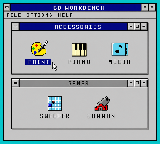
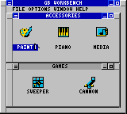

# Program Manager desktop design

## Selected direction

The selected direction is the dual tiled-groups concept:

The implementation treats this as visual direction rather than a bitmap to
copy. Chrome, type, and icons remain native GBC tiles and original clean-room
art.

## Implemented result

The source and native ROM capture are shown together in
`desktop-option-2-comparison-4x.png`; the focused group comparison is
`desktop-option-2-detail-comparison-4x.png`. The blocking design QA result is
recorded in the repository root `design-qa.md` as passed.

## Native 20 x 18 tile translation

| Surface | Tile bounds | Purpose |
| --- | --- | --- |
| Program Manager | `x=0, y=0, w=20, h=18` | Full native viewport and outer chrome |
| Menu | `x=1..18, y=1` | File, Options, Window, Help |
| Accessories | `x=1, y=2, w=18, h=8` | Three 32-pixel app cells |
| Games | `x=1, y=10, w=18, h=7` | Two 32-pixel app cells |

Accessory cell centers are 32, 80, and 128 pixels. Game cell centers are 48
and 112 pixels. Each app caption is rendered into an independent 32-pixel cell,
so no label can touch a neighbor or replace a frame tile.

## Revision 2 - Windows 3.1 chrome pass (2026-09-25)

The layout above is unchanged; the surface treatment moved closer to Windows
3.1 after the GBS Windows stock-take (`docs/STOCKTAKE.md`):

- All window text uses the original mixed-case proportional system font
  (`assets/system_font.txt`, cap height 6, x-height 4, 1-pixel descender).
- Client areas and menu bars are white; menus end in a black rule.
- Window frames are 4 pixels thick inside their 8-pixel tiles, leaving white
  padding; windows with grey clients use face-coloured frame variants.
- Title bars centre their text. Active titles are white on navy; inactive
  titles are black on white. Title buttons are the system-menu bar and the
  down/up arrow buttons.
- Captions are rendered into per-icon tile strips centred on the icon. The
  selected caption gets a tight navy box instead of a full-cell fill.
- Application windows (Sweeper, Piano, Media) are drawn over the Program
  Manager, which switches to inactive titles behind them.

## Visual rules (revision 1)

- Use a packed 3 x 5 glyph on a 4-pixel advance for desktop text only.
- Keep the existing application font unchanged.
- Active titles and the selected caption are white on royal blue.
- Inactive group chrome is gray with black text.
- Use the pointer and reversed caption as selection; remove the extra `+` mark.
- Render the pointer as a tail-free 45-degree triangle inside one 8 x 8 sprite,
  with a transparent right column and bottom row.
- Icon and caption share one 32 x 32 hit target.
- Icons are original 16 x 16 VGA-like art using the existing four-color icon
  palette.

## Reference provenance

Layout conventions were checked against an authentic Windows 3.1 Program
Manager screenshot. The local reference file is
`windows-3.1-program-manager-reference-cc0.png`; its Wikimedia Commons source
is CC0:

https://commons.wikimedia.org/wiki/File:Program_Manager_de_Windows_3.1.png

No Microsoft or commercial GBS Windows icon, music, or ROM asset is included.
